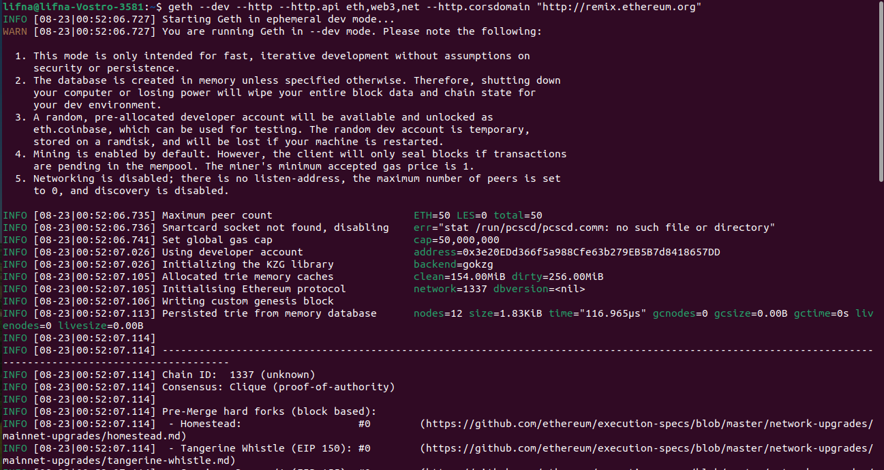

## Run-a-node-in-Geth-Developer-Mode
# Step - 1 : Start Geth in Dev Mode

geth --dev --http --http.api eth,web3,net --http.corsdomain "http://remix.ethereum.org"

## Acknowledgements
* [Go Etehreum - Developer Mode](https://geth.ethereum.org/docs/developers/dapp-developer/dev-mode)
* [Remix Ethereum IDE - Docs](https://remix-ide.readthedocs.io/en/latest/run.html#more-about-external-http-provider)
